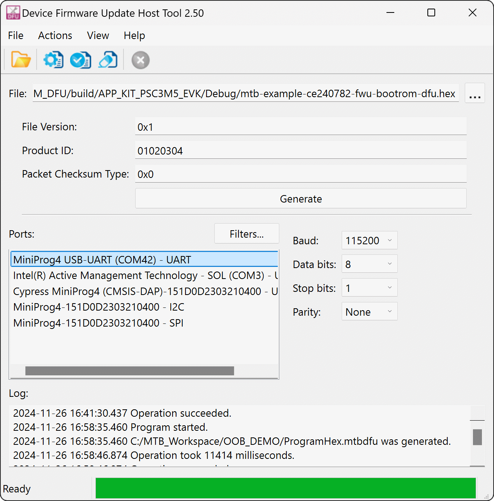
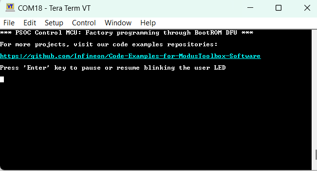

# PSOC&trade; Control MCU: Factory programming through BootRom DFU

This code example programs the OEM image using the BootRom DFU serial interface, guiding the user through the process. The DFU protocol, a proprietary Infineon-owned serial interface feature built into the immutable BootRom, supports UART, I2C, and SPI interfaces. This feature is designed for end-of-line programming or factory programming without a debugger. After transferring the image to the device, the BootRom validates the image (if secure boot is enabled) and launches the code. This code example closely follows the implementation of the PSOC&trade; Control MCU: Hello World using HAL code example. For more information, see the README.md of the Hello World code example.


## Requirements

- [ModusToolbox&trade;](https://www.infineon.com/modustoolbox) v3.3 or later
- Programming language: C
- Associated parts: All [PSOC&trade; Control C3](https://www.infineon.com/cms/en/product/microcontroller/32-bit-psoc-arm-cortex-microcontroller/psoc-6-32-bit-arm-cortex-m4-mcu/) parts
- PSOC&trade; Control C3 Board support package (BSP) minimum required version: (`KIT_PSC3M5_EVK`) 1.0.3


## Supported toolchains (make variable 'TOOLCHAIN')

- GNU Arm&reg; Embedded Compiler v11.3.1 (`GCC_ARM`) – Default value of `TOOLCHAIN`
- Arm&reg; Compiler v6.22 (ARM)
- IAR C/C++ Compiler v9.50.2 (IAR)


## Supported kits (make variable 'TARGET')

- [PSOC&trade; Control C3M5 Evaluation Kit](https://www.infineon.com/KIT_PSC3M5_EVK) (`KIT_PSC3M5_EVK`) – Default value of `TARGET`


## Hardware setup

This example uses the board's default configuration. See the kit user guide to ensure that the board is configured correctly.

Ensure the below jumper and pin configuration on the board.
- Ensure that the DFU port selection pins are serially disabled.
   > **Note:** For (`KIT_PSC3M5_EVK`) rev. **, DFU_SW1 and DFU_SW2 pins should be connected to Ground or High-Z position.


## Software setup

See the [ModusToolbox&trade; tools package installation guide](https://www.infineon.com/ModusToolboxInstallguide) for information about installing and configuring the tools package.

<details><summary><b>ModusToolbox&trade; Edge Protect Security Suite</b></summary>

1. Download and install the [Infineon Developer Center Launcher](https://www.infineon.com/cms/en/design-support/tools/utilities/infineon-developer-center-idc-launcher/).
2. Login using your Infineon credentials.
3. Download and install the “ModusToolbox&trade; Edge Protect Security Suite” from Developer Center Launcher.
    > **Note:** The default installation directory of the Edge Protect Security Suite in Windows operating system is *C:/Users/`<USER>`/Infineon/Tools*.<br>
4. After installing the Edge Protect Security Suite, add the Edge Protect tools executable to the system PATH variable.
    Edge Protect tools executable is located in *<Edge-Protect-Security-Suite-install-path>/ModusToolbox-Edge-Protect-Security-Suite-`<version>`/tools/edgeprotecttools/bin*.

</details>

Install a terminal emulator if you don't have one. Instructions in this document use [Tera Term](https://teratermproject.github.io/index-en.html).

This example requires no additional software or tools.


## Using the code example


### Create the project

The ModusToolbox&trade; tools package provides the Project Creator as both a GUI tool and a command line tool.

<details><summary><b>Use Project Creator GUI</b></summary>

1. Open the Project Creator GUI tool.

   There are several ways to do this, including launching it from the dashboard or from inside the Eclipse IDE. For more details, see the [Project Creator user guide](https://www.infineon.com/ModusToolboxProjectCreator) (locally available at *{ModusToolbox&trade; install directory}/tools_{version}/project-creator/docs/project-creator.pdf*).

2. On the **Choose Board Support Package (BSP)** page, select a kit supported by this code example. See [Supported kits](#supported-kits-make-variable-target).

   > **Note:** To use this code example for a kit not listed here, you may need to update the source files. If the kit does not have the required resources, the application may not work.

3. On the **Select Application** page:

   a. Select the **Applications(s) Root Path** and the **Target IDE**.

   > **Note:** Depending on how you open the Project Creator tool, these fields may be pre-selected for you.

   b. Select this code example from the list by enabling its check box.

   > **Note:** You can narrow the list of displayed examples by typing in the filter box.

   c. (Optional) Change the suggested **New Application Name** and **New BSP Name**.

   d. Click **Create** to complete the application creation process.

</details>


<details><summary><b>Use Project Creator CLI</b></summary>

The 'project-creator-cli' tool can be used to create applications from a CLI terminal or from within batch files or shell scripts. This tool is available in the *{ModusToolbox&trade; install directory}/tools_{version}/project-creator/* directory.

Use a CLI terminal to invoke the 'project-creator-cli' tool. On Windows, use the command-line 'modus-shell' program provided in the ModusToolbox&trade; installation instead of a standard Windows command-line application. This shell provides access to all ModusToolbox&trade; tools. You can access it by typing "modus-shell" in the search box in the Windows menu. In Linux and macOS, you can use any terminal application.

The following example clones the "**Basic Secure Application**" with the desired name "MySecureApp" configured for the *KIT_PSOCC3_EVK* BSP into the specified working directory, *C:/mtb_projects*:

   ```
   project-creator-cli --board-id KIT_PSOCC3_EVK --app-id mtb-example-psoc-control-basic-secure-app --user-app-name MySecureApp --target-dir "C:/mtb_projects"
   ```


The 'project-creator-cli' tool has the following arguments:

Argument | Description | Required/optional
---------|-------------|-----------
`--board-id` | Defined in the <id> field of the [BSP](https://github.com/Infineon?q=bsp-manifest&type=&language=&sort=) manifest | Required
`--app-id`   | Defined in the <id> field of the [CE](https://github.com/Infineon?q=ce-manifest&type=&language=&sort=) manifest | Required
`--target-dir`| Specify the directory in which the application is to be created if you prefer not to use the default current working directory | Optional
`--user-app-name`| Specify the name of the application if you prefer to have a name other than the example's default name | Optional
<br>

> **Note:** The project-creator-cli tool uses the `git clone` and `make getlibs` commands to fetch the repository and import the required libraries. For details, see the "Project creator tools" section of the [ModusToolbox&trade; tools package user guide](https://www.infineon.com/ModusToolboxUserGuide) (locally available at {ModusToolbox&trade; install directory}/docs_{version}/mtb_user_guide.pdf).

</details>


### Open the project

After the project has been created, you can open it in your preferred development environment.


<details><summary><b>Eclipse IDE</b></summary>

If you opened the Project Creator tool from the included Eclipse IDE, the project will open in Eclipse automatically.

For more details, see the [Eclipse IDE for ModusToolbox&trade; user guide](https://www.infineon.com/MTBEclipseIDEUserGuide) (locally available at *{ModusToolbox&trade; install directory}/docs_{version}/mt_ide_user_guide.pdf*).

</details>


<details><summary><b>Visual Studio (VS) Code</b></summary>

Launch VS Code manually, and then open the generated *{project-name}.code-workspace* file located in the project directory.

For more details, see the [Visual Studio Code for ModusToolbox&trade; user guide](https://www.infineon.com/MTBVSCodeUserGuide) (locally available at *{ModusToolbox&trade; install directory}/docs_{version}/mt_vscode_user_guide.pdf*).

</details>


<details><summary><b>Keil µVision</b></summary>

Double-click the generated *{project-name}.cprj* file to launch the Keil µVision IDE.

For more details, see the [Keil µVision for ModusToolbox&trade; user guide](https://www.infineon.com/MTBuVisionUserGuide) (locally available at *{ModusToolbox&trade; install directory}/docs_{version}/mt_uvision_user_guide.pdf*).

</details>


<details><summary><b>IAR Embedded Workbench</b></summary>

Open IAR Embedded Workbench manually, and create a new project. Then select the generated *{project-name}.ipcf* file located in the project directory.

For more details, see the [IAR Embedded Workbench for ModusToolbox&trade; user guide](https://www.infineon.com/MTBIARUserGuide) (locally available at *{ModusToolbox&trade; install directory}/docs_{version}/mt_iar_user_guide.pdf*).

</details>


<details><summary><b>Command line</b></summary>

If you prefer to use the CLI, open the appropriate terminal, and navigate to the project directory. On Windows, use the command-line 'modus-shell' program; on Linux and macOS, you can use any terminal application. From there, you can run various `make` commands.

For more details, see the [ModusToolbox&trade; tools package user guide](https://www.infineon.com/ModusToolboxUserGuide) (locally available at *{ModusToolbox&trade; install directory}/docs_{version}/mtb_user_guide.pdf*).

</details>


## Provisioning

To load the signed user application image, the device must be provisioned with the correct policy. Follow the steps below to provision the device.

1. Add policy and keys to the project.

   1. Ensure that you are in the *`<Workspace>/<CodeExampleName>`* directory.

   2. Execute the following command to add policy and keys to the project:
    ```
      edgeprotecttools -t psoc_c3 init
      ```

   > **Note:** After executing of the `init` command, all files that are required for provisioning will be copied into the *`<Workspace>/<CodeExampleName>`* directory, including the default policy for the chosen `<kit-name>`.

2. Add the keys to be used for provision of device into the project.

   Generate keys using the following command:

   ```
   edgeprotecttools create-key --key-type ECDSA-P256 -o keys/oem_rot_priv_key_0.pem keys/oem_rot_pub_key_0.pem
   ````
   ```
   edgeprotecttools create-key --key-type ECDSA-P256 -o keys/oem_rot_priv_key_1.pem keys/oem_rot_pub_key_1.pem
   ```

3. user can skip the step 2 and 3 if edge protect tools set up initialization is already done.

4. OEM provisioning:

   By default, the dfu_enable parameter value is configured as false. To enable BootRom DFU, the dfu_enable parameter value should be set to true (refer to policy/policy_oem_provisioning.json).
 
      "dfu_enable": {
         "description": "Indicates whether Device Firmware Update is enabled",
         "value": true
      },

   To provision the device, execute the following command
   ```
   edgeprotecttools -t psoc_c3 provision-device -p policy/policy_oem_provisioning.json
   ```


## Operation

1. Connect the (`KIT_PSC3M5_EVK`) to your PC using the provided USB cable through the KitProg3 USB connector.

2. Open a terminal program and select the KitProg3 COM port. Set the serial port parameters to 8N1 and 115200 baud.

3. Provision the PSOC&trade; Control device with dfu_enable = true and Make sure the following parameters are set as below prior provisioning for BOOT_SIMPLE_APP configuration. Refer to [Provisioning](#provisioning) section.

   **BOOT_SIMPLE_APP configuration for BootRom DFU**
      
   Parameter         | value            | Description
   :---------------- | :--------------- | :---------------
   prov_oem_complete | false            | Allowed to provision the device again
   boot_cfg_id       | BOOT_SIMPLE_APP  | Raw image shall be loaded, Image should not be signed
   dfu_enable        | true             | To enable BootRom DFU feature
   <br>

4. After provisioning, ensure that the DFU transport selection pins are serially enabled. Refer to the **DFU transport selection configurations** table for the correct switch positions of DFU_SW1 (P2.2) and DFU_SW2 (P2.3).

   > **Example:** To select the BootRom DFU I2C serial interface, connect pins 1 and 2 of J19 (DFU_SW1) with a jumper. Connect pins 2 and 3 of J22 (DFU_SW2) with a jumper.

   **DFU transport selection configurations**
      
   Pin         | P2.3 = Vss     | P2.3 = Vdd     | P2.3
   :---------- | :------------- | :------------- | :---------
   P2.2 = Vss  | Serial Disable | UART           | Serial Disable
   P2.2 = Vdd  | I2C            | SPI            | Serial Disable
   P2.2 = Vss  | UART           | Serial Disable | Serial Disable
   <br>

5. Connect the DFU communication pins to the External Miniprog4 port based on the interface selection as per the following details:
  
   **DFU communication protocol pins**

   Pin     | UART  | SPI   | I2C
   :------ | :---- | :---- | :----
   P8.0    |       | SS    |
   P8.1    | RX    | MOSI  |SCL
   P8.2    |       | MISO  |
   P8.3    | TX    | CLK   |SDA
   <br>

6. Make sure the GND and VTARG is connected between Miniprog4 and `KIT_PSC3M5_EVK`.

7. Connect the External Miniprog4 to the host PC and open the DFU Host Tool, which is part of the MTB IDE.

8. Configure the serial interface parameter as per the following details:

   **DFU transport configurations**
      
   DFU transport: I2C| Default |Description
   :---------------  | :------ | :-----
   Mode              | Slave   | Device acts as a slave
   Address           | 12      | 7-bit slave device address
   Data rate         |100 kbps | DFU supports standard data rate
   <br>

   DFU transport: UART| Default |Description
   :----------------- | :------- | :-----
   Mode               | Standard | Standard
   Baud rate(bps)     | 115200   | Supports standard baud rates from 19200 to 115200
   Data width         | 8 bits   | Standard frame
   Parity             | None     | Standard frame
   Stop bits          | 1 bit    | Standard frame
   Bit order          | LSB first| Standard frame
   <br>

   DFU transport: SPI | Default  |Description
   :------------------| :------  | :-----
   Mode               | Slave    | Device acts as a slave
   Shift direction    | MSB first| default direction set as MSB first  
   Clock speed        | 1 MHz    | DFU supports <=12Mbps speed
   Mode               | Mode 00  | default mode set as Mode 00
   <br>      

9. Reset the EVK (`KIT_PSC3M5_EVK`) by pressing the XRES push button.

10. Now, the BootRom enters DFU mode and will wait for the DFU Host (PC Tool) to send a new image.

11. In the DFU Host Tool, select the ports as per the wiring and set the parameter configuration as below.

   <details><summary><b>DFU protocol parameter configuration</b></summary>

- **UART**  : Baud =115200, Bits = 8, StopBits=1, RTS/CTS=No, Parity=None
- **SPI**   : Mode=Slave, Motorola 00 (CPHA=0, CPOL=0), Speed <=12Mbps
- **I2C**   : Speed=100k or 400K, Mode=Slave, 7-bit addr, address=0x35
   </details>

12. Select the image Hex file by clicking the 3 dots in the GUI.

13. Press the program button to send the image to the device. You can observe the progress bar in the GUI, as shown in **Figure 1**.

**Figure 1. FWU through BootRom DFU URAT**



14. After successful image transfer, BootRom launches the new application. "PSOC&trade; Control MCU: Factory programming through BootRom DFU" is displayed on the UART terminal and the user LED is blinking.

**Figure 2. Terminal FWU through BootRom DFU UART**



15. Revert back the DFU_SW1 and DFU_SW2 pins to serial disable state to avoid go to BootRom DFU mode on next power cycle or reset.

16. If user prefer secure boot, refer **Enable Secured Boot** section. You can skip this step, if you prefer only BOOT_SIMPLE_APP.

## Debugging

You can debug the example to step through the code.


<details><summary><b>In Eclipse IDE</b></summary>

Use the **\<Application Name> Debug (KitProg3_MiniProg4)** configuration in the **Quick Panel**. For details, see the "Program and debug" section in the [Eclipse IDE for ModusToolbox&trade; user guide](https://www.infineon.com/MTBEclipseIDEUserGuide).


</details>


<details><summary><b>In other IDEs</b></summary>

Follow the instructions in your preferred IDE.

</details>


## Design and implementation

This code example works with the PSOC&trade; Control EVK out of the box, that is shipped with "secured boot" disabled configuration. Here, "secured boot" refers to the signature verification of the first user application by the BootRom.


### Steps to enable secured boot flow 

**Pre-requisite**

Follow the steps in the Getting started with PSOC&trade; Control security AN or [Provisioning](#provisioning) section to create your keys and and provision the device

**Enable secured boot**

In order to enable "secured boot" in this code example, PSOC&trade; Control device needs to be provision with boot_cfg_id value as BOOT_ONE_SLOT and SECURED_BOOT flag should be set to TRUE in the application makefile.

BOOT_ONE_SLOT configuration allow user to have one primary image in flash. After power cycle/reset, the primary image shall be launched by BootRom.

**1. Enable postbuild signing for this code example**
   
   BootRom expects the first user application to be in the MCUboot format for BOOT_ONE_SLOT, BOOT_TWO_SLOTS, BOOT_THREE_SLOTS, and BOOT_IDLE (except for BOOT_SIMPLE_APP) configurations.
      
   To append the MCUboot header format with "mtb-example-ce240782-fwu-bootrom-dfu" image, the "SECURED_BOOT" flag needs to be set as TRUE in the user application makefile. By default "SECURED_BOOT" flag is set to FALSE.
 
   "SECURED_BOOT=TRUE" 
   
   Provide the private key path in the postbuild.mk file, which is used to sign the application.

   KEY_PATH=./`<edgeprotecttools installed path>`/keys/oem_private_key_0.pem

   Provide the edgeprotecttools path in the postbuild.mk file.

   EPT_PATH?=./`<edgeprotecttools installed path>`bin/edgeprotecttools


   Now build the application. This conditional "SECURED_BOOT" flag executes the postbuild script to appended with the MCUBoot Header during the postbuild step. 
      
   > **Note:** The same key pair should be used during provision the device.

**2. Provision the PSOC&trade; Control device with BOOT_ONE_SLOT**

   By default, boot_cfg_id value is configured as BOOT_SIMPLE_APP To enable "secure boot" flow, boot_cfg_id value should be set BOOT_ONE_SLOT. (refer policy/policy_oem_provisioning.json).BOOT_ONE_SLOT mean only one image shall be validated by BootRom and that image should be a first user image in the user flash area.
 
      "boot_cfg_id": {
      "description": "A behavior for BOOT_APP_LAYOUT (BOOT_SIMPLE_APP   applicable to NORMAL_PROVISIONED only)",
      "applicable_conf": "BOOT_SIMPLE_APP, BOOT_ONE_SLOT, BOOT_TWO_SLOTS, BOOT_THREE_SLOTS, BOOT_IDLE",
      "value": "BOOT_ONE_SLOT"
      },

   The boot_app_layout first slot address should be points to user application MCUboot header address.(refer policy/policy_oem_provisioning.json)

      "boot_app_layout": {
         "description": "The memory layout for the applications defined by BOOT_CFG_ID. 0x32000000 - 0x33FFFFFF for secure addresses; 0x22000000 - 0x23FFFFFF for non-secure addresses",
         "value": [
            {
               "address": "0x32000000",
               "size": "0x18000"
            },
            {
               "address": "0x00000000",
               "size": "0x00"
            },
            {
               "address": "0x00000000",
               "size": "0x00"
            }
         ]
      }

   Once the policy has been updated, provision the device with the updated policy.

      edgeprotecttools -t psoc_c3 provision-device -p policy/policy_oem_provisioning.json

   
   After provisioning, Follow the [Operation](#operation) section steps from point 4 to load the new application image. Now BootRom validates the user application and launches successfully.


**3. Provision the PSOC&trade; Control device with BOOT_ONE_SLOT** 
BOOT_ONE_SLOT configuration allow user to have one slots (primary) in flash. Through BootRom DFU user can overwrite the new image in to primary slot and further the BootRom will authenticate and launch the image.

Make sure the following parameters are set as below prior provisioning for BOOT_ONE_SLOT configuration.

**BOOT_ONE_APP configuration for BootRom DFU**
    
Parameter           | value            | Description
:------------------ | :--------------- | :---------------
prov_oem_complete   | false            | Allowed to provision the device again
boot_cfg_id         | BOOT_ONE_SLOT    | Image should be signed (MCUboot format)
dfu_enable          | true             | To enable BootRom DFU feature
      
boot_app_layout value's below mentioned are example. Revise according to your images:

Parameter           | value            | Description
:------------------ | :--------------- | :---------------     
address             | 0x32000000       | Primary image start address
size                | 0x10000          | size of primary image
<br>

**4. Provision the PSOC&trade; Control device with BOOT_TWO_SLOT** 

The BOOT_TWO_SLOT configuration allows the user to have two images in flash: a primary image and a secondary/staging image. By default, the primary image shall be launched by the BootRom if the flash does not have a secondary image or if the secondary image is invalid.

Through BootRom DFU, the user can load a new image (UPDATE) into the secondary/staging area, and further, the BootRom will authenticate the secondary image and move it to the primary location to launch the image.

Make sure the following parameters are set in the makefile and *postbuild.mk* file.

   **1. Build UPDATE IMAGE for this code example**

   SECURED_BOOT=TRUE
   IMG_TYPE?=UPDATE
   KEY_PATH=./`<edgeprotecttools installed path>`/keys/oem_private_key_0.pem
   EPT_PATH?=./`<edgeprotecttools installed path>`bin/edgeprotecttools

   **2. BOOT_TWO_SLOTS configuration for BootRom DFU**
    
Parameter           | value            | Description
:------------------ | :--------------- | :---------------
prov_oem_complete   | false            | Allowed to provision the device again
boot_cfg_id         | BOOT_TWO_SLOTS   | Image should be signed (MCUboot format)
dfu_enable          | true             | To enable BootRom DFU feature
boot_auth_l2_enable | true             | To enable authentication BY BootRom
boot_move_app       | true             | To enable Overwrites the primary image
      
boot_app_layout value's below mentioned are example. Revise according to your images:

Parameter           | value            | Description
:------------------ | :--------------- | :---------------
address             | 0x32000000       | Primary image start address
size                | 0x10000          | size of primary image
address             | 0x32010000       | Secondary image start
size                | 0x10000          | size of secondary image
<br>


### How is this code example different from **PSOC&trade; Control MCU: Hello world using HAL**?

1. An additional configurable postbuild step has been added to the Makefile of 'proj_cm33_s' to make it compatible with the BootRom and Edge Protect Bootloader.
2. The edgeprotecttools commands used in the postbuild of the 'proj_cm33_s' project may contain additional arguments for compatibility with the BootRom and Edge Protect Bootloader.

See README.md of the **PSOC&trade; Control MCU: Hello world using HAL** for details on the Hello world code example design and implementation.


### Resources and settings

**Table 1. Application resources**

 Resource  |  Alias/object     |    Purpose
 :-------- | :-------------    | :------------
 UART (PDL) |cy_retarget_io_uart_obj | UART HAL object used by Retarget-IO for the Debug UART port
 GPIO (PDL)    | CYBSP_USER_LED     | User LED
<br>


## Related resources

Resources  | Links
-----------|----------------------------------
Application notes | [AN238329](https://www.infineon.com/AN238329) – Getting started with PSOC&trade; Control C3 MCU on ModusToolbox&trade; <br> [AN240106](https://www.infineon.com/AN240106) - Getting started with PSOC&trade; Control C3 security
Code examples  | [Using ModusToolbox&trade;](https://github.com/Infineon/Code-Examples-for-ModusToolbox-Software) on GitHub
Device documentation | PSOC&trade; Control C3 MCU datasheet
Development kits | Select your kits from the [Evaluation board finder](https://www.infineon.com/cms/en/design-support/finder-selection-tools/product-finder/evaluation-board) page.
Libraries on GitHub  | [mtb-pdl-cat1](https://github.com/Infineon/mtb-pdl-cat1) – Peripheral Driver Library (PDL)  <br> [mtb-hal-cat1](https://github.com/Infineon/mtb-hal-cat1) – Hardware Abstraction Layer (HAL) library <br> [retarget-io](https://github.com/Infineon/retarget-io) – Utility library to retarget STDIO messages to a UART port
Tools  | [ModusToolbox&trade;](https://www.infineon.com/modustoolbox) – ModusToolbox&trade; software is a collection of easy-to-use libraries and tools enabling rapid development with Infineon MCUs for applications ranging from wireless and cloud-connected systems, edge AI/ML, embedded sense and control, to wired USB connectivity using PSOC&trade; Industrial/IoT MCUs, AIROC&trade; Wi-Fi and Bluetooth&reg; connectivity devices, XMC&trade; Industrial MCUs, and EZ-USB&trade;/EZ-PD&trade; wired connectivity controllers. ModusToolbox&trade; incorporates a comprehensive set of BSPs, HAL, libraries, configuration tools, and provides support for industry-standard IDEs to fast-track your embedded application development.
<br>


## Other resources

Infineon provides a wealth of data at [www.infineon.com](https://www.infineon.com) to help you select the right device, and quickly and effectively integrate it into your design.


## Document history

Document title: *CE240782* – *PSOC&trade; Control MCU: Factory programming through BootRom DFU*

 Version | Description of change
 ------- | ---------------------
 1.0.0   |  New code example
<br>


All referenced product or service names and trademarks are the property of their respective owners.

The Bluetooth&reg; word mark and logos are registered trademarks owned by Bluetooth SIG, Inc., and any use of such marks by Infineon is under license.


---------------------------------------------------------

© Cypress Semiconductor Corporation, 2020-2024. This document is the property of Cypress Semiconductor Corporation, an Infineon Technologies company, and its affiliates ("Cypress").  This document, including any software or firmware included or referenced in this document ("Software"), is owned by Cypress under the intellectual property laws and treaties of the United States and other countries worldwide.  Cypress reserves all rights under such laws and treaties and does not, except as specifically stated in this paragraph, grant any license under its patents, copyrights, trademarks, or other intellectual property rights.  If the Software is not accompanied by a license agreement and you do not otherwise have a written agreement with Cypress governing the use of the Software, then Cypress hereby grants you a personal, non-exclusive, nontransferable license (without the right to sublicense) (1) under its copyright rights in the Software (a) for Software provided in source code form, to modify and reproduce the Software solely for use with Cypress hardware products, only internally within your organization, and (b) to distribute the Software in binary code form externally to end users (either directly or indirectly through resellers and distributors), solely for use on Cypress hardware product units, and (2) under those claims of Cypress's patents that are infringed by the Software (as provided by Cypress, unmodified) to make, use, distribute, and import the Software solely for use with Cypress hardware products.  Any other use, reproduction, modification, translation, or compilation of the Software is prohibited.
<br>
TO THE EXTENT PERMITTED BY APPLICABLE LAW, CYPRESS MAKES NO WARRANTY OF ANY KIND, EXPRESS OR IMPLIED, WITH REGARD TO THIS DOCUMENT OR ANY SOFTWARE OR ACCOMPANYING HARDWARE, INCLUDING, BUT NOT LIMITED TO, THE IMPLIED WARRANTIES OF MERCHANTABILITY AND FITNESS FOR A PARTICULAR PURPOSE.  No computing device can be absolutely secure.  Therefore, despite security measures implemented in Cypress hardware or software products, Cypress shall have no liability arising out of any security breach, such as unauthorized access to or use of a Cypress product. CYPRESS DOES NOT REPRESENT, WARRANT, OR GUARANTEE THAT CYPRESS PRODUCTS, OR SYSTEMS CREATED USING CYPRESS PRODUCTS, WILL BE FREE FROM CORRUPTION, ATTACK, VIRUSES, INTERFERENCE, HACKING, DATA LOSS OR THEFT, OR OTHER SECURITY INTRUSION (collectively, "Security Breach").  Cypress disclaims any liability relating to any Security Breach, and you shall and hereby do release Cypress from any claim, damage, or other liability arising from any Security Breach.  In addition, the products described in these materials may contain design defects or errors known as errata which may cause the product to deviate from published specifications. To the extent permitted by applicable law, Cypress reserves the right to make changes to this document without further notice. Cypress does not assume any liability arising out of the application or use of any product or circuit described in this document. Any information provided in this document, including any sample design information or programming code, is provided only for reference purposes.  It is the responsibility of the user of this document to properly design, program, and test the functionality and safety of any application made of this information and any resulting product.  "High-Risk Device" means any device or system whose failure could cause personal injury, death, or property damage.  Examples of High-Risk Devices are weapons, nuclear installations, surgical implants, and other medical devices.  "Critical Component" means any component of a High-Risk Device whose failure to perform can be reasonably expected to cause, directly or indirectly, the failure of the High-Risk Device, or to affect its safety or effectiveness.  Cypress is not liable, in whole or in part, and you shall and hereby do release Cypress from any claim, damage, or other liability arising from any use of a Cypress product as a Critical Component in a High-Risk Device. You shall indemnify and hold Cypress, including its affiliates, and its directors, officers, employees, agents, distributors, and assigns harmless from and against all claims, costs, damages, and expenses, arising out of any claim, including claims for product liability, personal injury or death, or property damage arising from any use of a Cypress product as a Critical Component in a High-Risk Device. Cypress products are not intended or authorized for use as a Critical Component in any High-Risk Device except to the limited extent that (i) Cypress's published data sheet for the product explicitly states Cypress has qualified the product for use in a specific High-Risk Device, or (ii) Cypress has given you advance written authorization to use the product as a Critical Component in the specific High-Risk Device and you have signed a separate indemnification agreement.
<br>
Cypress, the Cypress logo, and combinations thereof, ModusToolbox, PSoC, CAPSENSE, EZ-USB, F-RAM, and TRAVEO are trademarks or registered trademarks of Cypress or a subsidiary of Cypress in the United States or in other countries. For a more complete list of Cypress trademarks, visit www.infineon.com. Other names and brands may be claimed as property of their respective owners.
